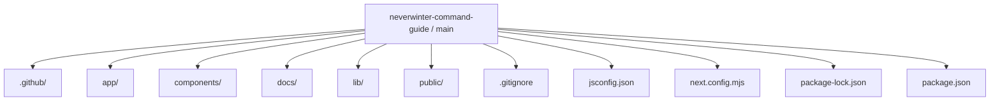
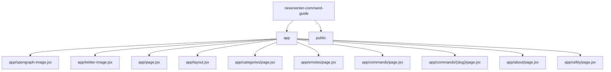
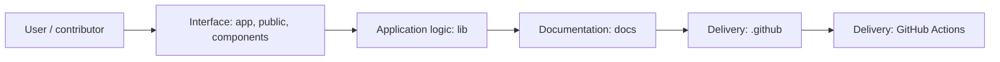
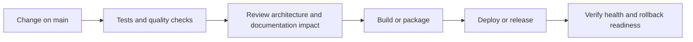
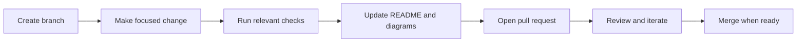

<!-- interactive-readme-standard:start -->

<div align="center">

# neverwinter-command-guide

**Branch-aware technical guide for [`main`](https://github.com/Nischhalsubba/neverwinter-command-guide/tree/main)**

<p>     </p>

<p>
  <a href="https://github.com/Nischhalsubba/neverwinter-command-guide/tree/main"><strong>Browse source</strong></a> ·
  <a href="https://github.com/Nischhalsubba/neverwinter-command-guide/issues"><strong>Issues</strong></a> ·
  <a href="https://github.com/Nischhalsubba/neverwinter-command-guide/codespaces/new?ref=main"><strong>Open in Codespaces</strong></a>
</p>

</div>

> [!IMPORTANT]
> This guide is generated from the files actually present on `main`. It links to detected source paths, preserves project-authored notes, and avoids claiming components that were not found.

## At a glance

| Item | Detected value |
|---|---|
| Purpose | A static Next.js and React fan-made Neverwinter slash-command reference with searchable command data, command detail routes, category pages, SEO metadata, sitemap/robots support, GSAP motion, and copy-ready command examples. |
| Branch role | Default branch |
| Stack | Next.js, React, JavaScript, CSS |
| Manifests | package.json |
| Prerequisites | Node.js |
| Delivery | GitHub Actions |
| License | No license file detected |

## Branch scope

This is the repository's default branch.


## Quick start

```bash
npm install
npm run dev
npm run start
npm run build
```

### Configuration surface

- No committed environment example file was detected.

> Never commit secrets, private keys, production credentials, customer data, or unredacted infrastructure details.

## Repository map



| Responsibility | Detected source paths |
|---|---|
| Interface | [`app`](https://github.com/Nischhalsubba/neverwinter-command-guide/tree/main/app), [`public`](https://github.com/Nischhalsubba/neverwinter-command-guide/tree/main/public), [`components`](https://github.com/Nischhalsubba/neverwinter-command-guide/tree/main/components) |
| Application logic | [`lib`](https://github.com/Nischhalsubba/neverwinter-command-guide/tree/main/lib) |
| Documentation | [`docs`](https://github.com/Nischhalsubba/neverwinter-command-guide/tree/main/docs) |
| Delivery | [`.github`](https://github.com/Nischhalsubba/neverwinter-command-guide/tree/main/.github) |

## Website or application map



## Architecture and responsibility flow




## Quality, security, and operations

<table>
<tr>
<td width="33%" valign="top">

### Quality

- No conventional test directory was detected automatically.

Detected commands:
- `npm run dev`
- `npm run start`
- `npm run build`

</td>
<td width="33%" valign="top">

### Security

- No dedicated security policy or automated dependency configuration was detected.

Review authentication, authorization, input validation, dependency updates, secret handling, and failure recovery before release.

</td>
<td width="34%" valign="top">

### Observability

- No dedicated observability integration was detected automatically.

Define useful logs, metrics, traces, alerts, and rollback signals for production-facing branches.

</td>
</tr>
</table>

## Delivery flow



### Automation detected

- [`.github/workflows/apply-interactive-readme.yml`](https://github.com/Nischhalsubba/neverwinter-command-guide/blob/main/.github/workflows/apply-interactive-readme.yml)

## Contribution flow



- Keep changes focused and explain architectural consequences.
- Run the checks relevant to the changed area.
- Update diagrams whenever routes, modules, data models, authentication, jobs, or delivery paths change.
- Add screenshots or recordings for visual behavior changes when useful.
- Use issues for reproducible defects and pull requests for reviewable changes.

## Ownership and support

| Topic | Source |
|---|---|
| Repository | [`Nischhalsubba/neverwinter-command-guide`](https://github.com/Nischhalsubba/neverwinter-command-guide) |
| Branch | [`main`](https://github.com/Nischhalsubba/neverwinter-command-guide/tree/main) |
| Ownership | No CODEOWNERS file detected |
| Contributing | Use the contribution flow above |
| Support | [Open or review issues](https://github.com/Nischhalsubba/neverwinter-command-guide/issues) |
| License | No license file detected |

<details>
<summary><strong>Documentation maintenance checklist</strong></summary>

- [ ] Purpose and branch scope are accurate.
- [ ] Setup and configuration commands still work.
- [ ] Repository, application, API, data, authentication, job, and deployment diagrams match the code.
- [ ] Tests, security controls, observability, and rollback behavior are documented.
- [ ] Links point to real files on this branch.
- [ ] No secrets or private operational details are exposed.

</details>

<!-- interactive-readme-standard:end -->

<!-- project-authored-notes:start -->
<details>
<summary><strong>Project-authored notes preserved from this branch</strong></summary>

<div align="center">

# Neverwinter Command Guide

### Search-First Slash Command Reference for Neverwinter Players

**A fan-made, premium command library for Neverwinter slash commands, chat tools, emotes, utility shortcuts, display controls, examples, aliases, category pages, and static SEO-friendly command detail routes.**


</div>

---

## ✨ Overview

**Neverwinter Command Guide** is a fan-made, search-first reference site for Neverwinter slash commands, chat tools, emotes, utility shortcuts, and display controls.

The project is built as a focused editorial library rather than a generic command dump, with the goal of helping players find the right command quickly, understand what it does, and use it with confidence.

The site is designed around a simple premise: a command guide should feel as intentional as the game knowledge it documents. Players often remember fragments instead of full syntax. They might know `/r`, but not `Reply to Last Whisper`. They might remember that a screenshot command exists, but not whether it saves the UI. The interface is built to support that real-world lookup behavior.

---

## 🧭 Table of Contents

- [Project Goals](#project-goals)
- [Product Direction](#product-direction)
- [Design Philosophy](#design-philosophy)
- [Why The Design Looks The Way It Does](#why-the-design-looks-the-way-it-does)
- [Content Strategy](#content-strategy)
- [SEO Strategy](#seo-strategy)
- [Accessibility Principles](#accessibility-principles)
- [Responsive Behavior](#responsive-behavior)
- [Information Architecture](#information-architecture)
- [Tech Stack](#tech-stack)
- [Project Structure](#project-structure)
- [Local Development](#local-development)
- [Content Editing Notes](#content-editing-notes)
- [Editorial Rules](#editorial-rules)
- [Quality Checklist](#quality-checklist)
- [Disclaimer](#disclaimer)

---

## Project Goals

This project is built to solve four practical problems:

- Make Neverwinter commands easy to search by syntax, alias, title, or category.
- Turn scattered or dry command references into readable, useful, player-facing content.
- Present commands inside a premium visual system that feels coherent across desktop, tablet, and mobile.
- Build a content structure that is technically strong for SEO while still being useful to real players first.

## Product Direction

The site is intentionally structured as a command library, not a traditional marketing homepage.

That choice shapes everything:

- The navigation is designed to move users toward command discovery, not brand storytelling.
- The command archive is treated as the core product.
- Category pages act as high-intent landing pages for search.
- Individual command detail pages provide deeper context, examples, and alias support.

This creates a layered information architecture:

1. Homepage for orientation and entry points.
2. `/commands` as the primary searchable archive.
3. Category pages for intent-based browsing.
4. Command detail pages for long-tail discovery and deeper explanation.

## Design Philosophy

The visual direction is rooted in three ideas:

### 1. Arcane atmosphere without clutter

Neverwinter is a fantasy MMO, but command documentation can become noisy very quickly if the design leans too hard into ornamental “game UI” tropes. The interface therefore borrows mood from fantasy dashboards and arcane HUDs, while keeping the structure editorial and readable.

That balance is created through:

- deep blue-black backgrounds instead of flat black
- restrained gold accents for hierarchy and warmth
- cool cyan highlights for interactivity and focus
- layered gradients instead of loud texture overload

### 2. Search-first clarity

The primary user action is command lookup. The layout therefore prioritizes:

- a prominent search entry point
- category shortcuts near the top of the archive
- “Most Used Commands” before the full directory
- consistent card anatomy so scanning is predictable

Every command card follows the same order:

1. Category badge
2. Copy action
3. Syntax block
4. Command title
5. Description
6. Example
7. Alias
8. Optional note

That repetition is deliberate. The goal is to reduce cognitive load when users are comparing multiple commands quickly.

### 3. Premium UI with readable contrast

The interface uses a dark-shell palette, but not at the expense of accessibility. Surfaces are built with strong tonal separation, text colors are elevated above decorative contrast, and interactive states use brighter accent values with visible focus treatment.

This approach allows the site to feel polished without sacrificing legibility.

## Why The Design Looks The Way It Does

Several design decisions were made to support both aesthetics and usability.

### Typography

The type system distinguishes between product voice and technical content:

- Display and headline typography adds gravity and identity.
- Body typography stays clean, readable, and practical.
- Syntax and command labels use a more mechanical visual rhythm so commands feel distinct from prose.

This helps the site communicate two modes at once: editorial guidance and command-reference precision.

### Color System

The palette is intentionally narrow:

- `--bg` and `--panel-*` create a unified dark environment.
- `--gold` is used for emphasis and hierarchy.
- `--accent` and `--accent-strong` indicate interaction, filtering, and active surfaces.
- `--muted` and `--muted-strong` separate supporting text from primary text without reducing readability too far.

Using a constrained palette prevents the site from feeling fragmented across pages.

### Card Surfaces

The original challenge with command libraries is that cards often either feel too generic or too decorative. Here, the cards are meant to feel like durable interface components rather than marketing tiles. That is why they use:

- strong border definition
- dense, dark gradients
- consistent syntax panels
- low-noise shadows
- compact but readable metadata lines

The result is a UI that supports browsing dozens of commands without becoming visually exhausting.

## Content Strategy

The content is written to do more than label commands. Each page tries to answer the practical question behind the query.

Examples:

- A player searching for `Neverwinter whisper command` does not just need syntax. They need to know what the command does and whether aliases exist.
- A player searching for `Neverwinter combat log` likely wants to know how to turn it on and off, not just that the command exists.
- A player on an emotes page is often browsing socially rather than solving a technical problem, so the copy should feel lighter and more contextual.

That is why the site uses:

- clear command titles
- one-line descriptions
- specific examples
- alias coverage
- contextual notes when documentation is incomplete

This also improves long-tail SEO because the content reflects real search intent instead of relying on raw keyword stuffing.

## SEO Strategy

The project is optimized around topical relevance, crawlability, and internal structure.

### On-page SEO

The site uses:

- route-level metadata for homepage, archive pages, category pages, and command detail pages
- descriptive titles and meta descriptions
- canonical URLs
- Open Graph metadata
- crawl-friendly page structure and semantic headings

### Programmatic SEO

Every command detail page is statically generated. This creates indexable pages for command-specific queries such as:

- alliance chat command
- whisper command
- reply command
- screenshot command
- combat log command

These pages are especially useful for long-tail search traffic because they give each command its own dedicated topical surface.

### Internal Linking

The site is intentionally cross-linked:

- homepage modules surface major command groups
- category pages point users toward relevant command clusters
- archive cards link to detail pages
- detail pages reinforce category context

This improves both user navigation and crawl depth.

### Technical SEO

The codebase includes:

- static generation for command pages
- sitemap generation
- robots directives
- route-level canonical handling
- metadata suitable for social sharing previews

## Accessibility Principles

The project treats accessibility as a baseline design requirement rather than a post-launch check.

Key decisions include:

- visible keyboard focus states
- skip link support
- strong foreground/background contrast
- semantic landmarks and heading structure
- search and filter UI that remains readable on smaller screens

The design avoids relying on color alone to communicate state, and interactive controls are built with clear affordances.

## Responsive Behavior

The site is designed to work across desktop, tablet, and mobile.

The layout adapts by:

- collapsing multi-column grids into single-column stacks
- reducing visual density without removing structure
- keeping the command search area prominent on smaller screens
- preserving readable spacing around code-like syntax blocks

This is especially important for a game reference site, since players often search while multitasking between devices.

## Information Architecture

### Homepage

The homepage is a guided entry point. It introduces the command library, explains what the project covers, and pushes users toward the most useful command groups.

### Commands Archive

`/commands` is the core product surface. It combines:

- hero search
- category shortcuts
- featured commands
- full archive browsing
- developer tricks
- FAQ support

This page is designed for both immediate search and exploratory scanning.

### Category Pages

Category pages exist because command intent matters. Players do not always think in alphabetical order. They think in tasks:

- “I need whisper syntax.”
- “I want emotes.”
- “I need utility commands.”

These pages convert that intent into faster discovery.

### Command Detail Pages

Detail pages turn commands into standalone reference entries. They provide:

- syntax
- explanation
- example usage
- alias information
- category context

This improves both usability and search reach.

## Tech Stack

| Layer | Technology |
|---|---|
| Framework | Next.js `15.5.14` |
| UI | React `19.1.0` |
| Routing | App Router |
| Motion | GSAP `3.14.2` |
| Styling | CSS Modules / global CSS |
| Rendering | Static generation for command detail pages |

The implementation stays intentionally lightweight. The project does not rely on a heavy CMS or component framework because the information model is compact and the pages benefit from being fast and static.

## Project Structure

```text
app/
  about/
  categories/
  commands/
    [slug]/
  emotes/
  utility/
components/
  command-library.jsx
  command-preview-grid.jsx
  site-header.jsx
lib/
  commands-data.js
  site.js
```

### Important Files

- `app/layout.jsx`  
  Defines global metadata, fonts, and the shared application shell.

- `app/globals.css`  
  Contains the design tokens, base palette, typography variables, and shared global styling.

- `components/command-library.jsx`  
  Powers the searchable `/commands` experience, including category filtering, featured commands, and the archive layout.

- `components/command-preview-grid.jsx`  
  Renders reusable command card grids used across the homepage and category pages.

- `lib/commands-data.js`  
  Stores the command dataset, category content, quick-help links, FAQ content, and helper utilities for routing and grouping.

## Local Development

Install dependencies:

```bash
npm install
```

Start the development server:

```bash
npm run dev
```

Create a production build:

```bash
npm run build
```

Run the production server locally:

```bash
npm run start
```

## Content Editing Notes

Most of the editable command content lives in `lib/commands-data.js`.

When adding a command, include:

- `id`
- `syntax`
- `title`
- `description`
- `example`
- `aliases`
- `category`
- optional `note` and `noteText`
- `letter`

The detail pages are generated from this data, so keeping the content model clean is important.

## Editorial Rules

The writing style for this project follows a few simple rules:

- Lead with usefulness, not fluff.
- Prefer direct explanations over lore-like filler.
- Treat undocumented commands carefully.
- Use examples that feel like real player behavior.
- Keep syntax copy-ready.

These rules are what make the site feel like a reference tool instead of a decorative shell wrapped around weak content.

## Quality Checklist

- [ ] Search works by syntax, title, alias, and category.
- [ ] Command detail pages generate successfully.
- [ ] Category pages have clear internal links.
- [ ] Copy buttons work reliably.
- [ ] Syntax blocks are readable on mobile.
- [ ] SEO metadata is unique per route.
- [ ] Sitemap and robots files are valid.
- [ ] Keyboard focus is visible.
- [ ] Dark surfaces maintain readable contrast.

## Disclaimer

Neverwinter Command Guide is a fan-made project and is not affiliated with Cryptic Studios, Gearbox Publishing, Wizards of the Coast, or the official Neverwinter website. All trademarks and game-related intellectual property remain the property of their respective owners.

## Closing Note

This project is deliberately narrow in scope, and that is part of its strength. It does not try to be a wiki, a lore archive, or a catch-all fansite. It focuses on one job: making Neverwinter commands easier to find, easier to understand, and easier to use.

That focus is what drives both the design system and the content model.

</details>
<!-- project-authored-notes:end -->
