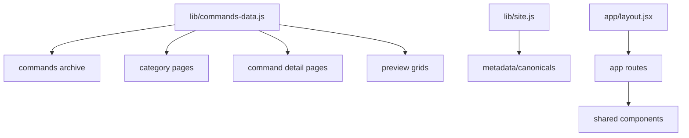

# Neverwinter Command Guide — Product and Engineering Case Study

> A comprehensive product, content, SEO, accessibility, frontend architecture, and maintenance case study for the Neverwinter Command Guide repository. This document is intentionally detailed so future maintainers, portfolio reviewers, designers, engineers, and AI coding agents can understand the project without turning `lib/commands-data.js` into a sacred cave painting. Documentation: humanity's desperate attempt to leave breadcrumbs before the next refactor eats the trail.

## Table of Contents

1. [Executive Summary](#executive-summary)
2. [Repository Snapshot](#repository-snapshot)
3. [Product Context](#product-context)
4. [Problem Statement](#problem-statement)
5. [Target Users](#target-users)
6. [Product Principles](#product-principles)
7. [Information Architecture](#information-architecture)
8. [Command Data Model](#command-data-model)
9. [Content and Editorial Strategy](#content-and-editorial-strategy)
10. [Search and Discovery Strategy](#search-and-discovery-strategy)
11. [SEO and Programmatic Pages](#seo-and-programmatic-pages)
12. [Route and Page Strategy](#route-and-page-strategy)
13. [Frontend Architecture](#frontend-architecture)
14. [Design System Direction](#design-system-direction)
15. [Accessibility Strategy](#accessibility-strategy)
16. [Responsive Strategy](#responsive-strategy)
17. [Motion Strategy](#motion-strategy)
18. [Copy, Syntax, and Example Rules](#copy-syntax-and-example-rules)
19. [Command Verification Strategy](#command-verification-strategy)
20. [Content Expansion Strategy](#content-expansion-strategy)
21. [Quality Assurance Strategy](#quality-assurance-strategy)
22. [Performance Strategy](#performance-strategy)
23. [Privacy, Legal, and Fan-Project Notes](#privacy-legal-and-fan-project-notes)
24. [Maintenance Playbook](#maintenance-playbook)
25. [Risk Register](#risk-register)
26. [Roadmap](#roadmap)
27. [Portfolio Review Notes](#portfolio-review-notes)
28. [AI Coding Agent Notes](#ai-coding-agent-notes)
29. [Appendix A: Suggested Command Schema](#appendix-a-suggested-command-schema)
30. [Appendix B: Suggested Category Schema](#appendix-b-suggested-category-schema)
31. [Appendix C: Manual QA Matrix](#appendix-c-manual-qa-matrix)
32. [Appendix D: Editorial Checklist](#appendix-d-editorial-checklist)
33. [Appendix E: Glossary](#appendix-e-glossary)
34. [Disclaimer](#disclaimer)

---

## Executive Summary

**Neverwinter Command Guide** is a focused, fan-made reference site for Neverwinter slash commands, chat tools, whispers, emotes, utility commands, screenshot commands, combat-log commands, aliases, command examples, and category-based discovery.

The project is built with Next.js, React, App Router pages, static command detail routes, a central command dataset, route-level metadata, search-oriented content structure, GSAP motion, global CSS design tokens, and SEO-oriented architecture. Unlike a generic wiki or catch-all fan site, this repository has a narrow product promise: help players find, understand, copy, and use Neverwinter commands quickly.

The site is designed around real lookup behavior. Players often remember fragments of a command instead of the exact syntax. A player may remember that `/r` replies to a whisper but not remember the full label. Another player may need `/CombatLog 1` before using a parser but not know how to disable it. Another may want screenshot commands, emotes, party chat, guild chat, officer chat, zone chat, or stuck recovery without digging through scattered forum posts and half-updated references, because naturally even basic command syntax has to become an archaeological exercise.

This case study documents the product reasoning, content model, editorial rules, search strategy, SEO strategy, accessibility principles, design direction, frontend architecture, risks, and maintenance practices required to keep the project useful and trustworthy.

---

## Repository Snapshot

| Attribute | Value |
|---|---|
| Repository | `Nischhalsubba/neverwinter-command-guide` |
| App type | Static fan-made command reference site |
| Framework | Next.js `15.5.14` |
| UI | React `19.1.0` |
| Routing | App Router |
| Rendering direction | Static pages and generated command routes |
| Motion | GSAP `3.14.2` |
| Styling | Global CSS and CSS module-style component structure |
| Content source | `lib/commands-data.js` |
| Primary product surface | `/commands` archive |
| Secondary surfaces | category pages, command detail pages, emotes, utility pages |
| Package manager | npm `11.6.2` |
| Node requirement | `>=22.0.0` |
| Build command | `npm run build` |
| License metadata | `UNLICENSED` |
| Project status | Focused public fan-reference project |

---

## Product Context

Game command references often fail in predictable ways. They are incomplete, hard to search, written like technical leftovers, or buried in wiki pages where every command receives the same lifeless treatment. Neverwinter Command Guide treats command lookup as a product experience, not just a list.

The product context is simple:

- players need commands during play
- players do not always remember full syntax
- players may search by task rather than command name
- command behavior can vary between patches or clients
- commands often have aliases
- utility commands need warnings and context
- undocumented commands need careful wording
- SEO matters because many players search from outside the site

The project therefore organizes commands around player intent. It is not trying to become a complete Neverwinter wiki, lore archive, build planner, or combat parser. That restraint is a strength. Tiny miracle: a project that knows what it is not.

---

## Problem Statement

### User problem

Players need a fast, reliable way to find command syntax and understand when to use it.

### Content problem

Raw command lists do not explain enough. A useful reference needs syntax, aliases, examples, categories, caveats, and plain-language descriptions.

### Product problem

A command guide must support both immediate search and exploratory browsing. Some users arrive with a command fragment. Some arrive with a task. Some arrive through Google. Some arrive from another Neverwinter tool and only need one specific command.

### Technical problem

The command dataset must remain structured enough to generate archive pages, category pages, detail pages, metadata, internal links, and future search/index logic without duplicating content across routes.

### Trust problem

Some commands may be undocumented, patch-sensitive, client-dependent, or behaviorally inconsistent. The site should not present uncertain commands with the same confidence as verified core commands.

---

## Target Users

### 1. New players

New players need plain explanations and useful examples. They may not know what alliance chat, guild chat, zone chat, whisper, or combat log commands are.

Needs:

- simple descriptions
- safe examples
- category browsing
- obvious copy buttons
- beginner-friendly wording

### 2. Returning players

Returning players may remember old commands but forget aliases or exact syntax.

Needs:

- fast search
- alias support
- examples
- notes about variability

### 3. Endgame players

Endgame players often need utility commands such as combat logging, screenshots, invite commands, party chat, or stuck recovery.

Needs:

- quick lookup
- parser-adjacent command support
- exact syntax
- notes on enabling/disabling utilities

### 4. Guild and alliance organizers

Organizers use communication commands frequently.

Needs:

- party, guild, officer, alliance, and zone chat references
- copy-ready examples
- category pages for communication commands

### 5. Roleplayers and social users

Social users look for emotes and interaction commands.

Needs:

- browseable emote section
- lighter descriptive copy
- clear cosmetic/social context

### 6. Maintainers

Maintainers need a clean schema and editorial rules.

Needs:

- command data model
- routing rules
- QA checklist
- verification process
- SEO and metadata notes

---

## Product Principles

### 1. Search first

The core action is lookup. Search should work by syntax, title, alias, category, and user intent where possible.

### 2. Syntax must be copy-ready

A command reference fails if users cannot copy or confidently type the command.

### 3. Context matters

Descriptions should explain what the command does, not merely repeat the title.

### 4. Aliases deserve visibility

Players may know `/w` but not `/tell`, or `/g` but not `/guild`. Alias handling is central to search.

### 5. Category pages should match mental models

Players think in tasks: chat, whisper, utility, display, emotes. They do not always think alphabetically.

### 6. Uncertainty should be labeled

Commands with patch or client variability should include notes.

### 7. SEO should serve humans first

Programmatic pages are useful only if they answer real questions. Otherwise, SEO becomes landfill with headings.

---

## Information Architecture

The site uses a layered information architecture.

```mermaid
flowchart TD
    HOME[Homepage] --> ARCHIVE[/commands archive]
    HOME --> CATEGORIES[Category entry points]
    ARCHIVE --> SEARCH[Search and filters]
    ARCHIVE --> CARDS[Command cards]
    CARDS --> DETAIL[Command detail pages]
    CATEGORIES --> CATPAGE[Category pages]
    CATPAGE --> DETAIL
    DETAIL --> RELATED[Related category context]
```

### Homepage

The homepage orients the user and sends them toward high-value entry points.

Recommended homepage sections:

- hero search
- most used commands
- command categories
- utility callouts
- combat-log and screenshot shortcuts
- FAQ or quick help

### Commands archive

The `/commands` archive is the product center. It should support:

- search
- category filtering
- featured or most-used commands
- full archive browsing
- copy action
- command detail links

### Category pages

Category pages serve task-based browsing and SEO. They should introduce the category, list commands, and link to detail pages.

### Detail pages

Detail pages should provide the deepest command context:

- syntax
- plain explanation
- example
- aliases
- category
- note/caution if needed
- related commands if available

---

## Command Data Model

The current command dataset lives in `lib/commands-data.js`.

### Current command fields

| Field | Purpose |
|---|---|
| `id` | Stable identifier and likely route slug basis |
| `syntax` | Copy-ready command syntax |
| `title` | Human-readable command name |
| `description` | Plain-language explanation |
| `example` | Practical command usage example |
| `aliases` | Alternative syntaxes |
| `category` | User-facing grouping |
| `section` | Optional section such as Most Used |
| `anchor` | Internal page/category anchor |
| `letter` | Alphabetical grouping support |
| `note` | Short note label |
| `noteText` | Full note explanation |

### Data model strengths

- central source of truth
- simple object shape
- supports archive cards
- supports detail pages
- supports category groupings
- supports aliases and notes

### Data model risks

- no explicit verification status
- no explicit source field
- no patch/version field
- no explicit related commands array
- no difficulty or user-intent tags
- no examples array for complex commands

### Suggested evolution

Add optional fields gradually:

```js
{
  id: "combat-log",
  syntax: "/CombatLog 1",
  title: "Toggle Combat Log",
  description: "Turn combat logging on for parser-friendly log output.",
  example: "/CombatLog 1",
  aliases: [],
  category: "Utility",
  section: "Most Used",
  anchor: "utility-commands",
  letter: "C",
  verificationStatus: "verified",
  sourceNotes: "Confirmed by in-game usage or current community reference.",
  patchContext: "Known behavior may vary by client/patch.",
  related: ["combat-log-off", "showfps"]
}
```

---

## Content and Editorial Strategy

The editorial strategy is the difference between a helpful command library and a dead command spreadsheet with CSS.

### Editorial goals

- write in plain English
- lead with use case
- keep syntax exact
- keep examples realistic
- mark uncertain behavior
- avoid lore filler
- avoid overclaiming official status

### Description pattern

Good command descriptions answer:

1. What does this command do?
2. When would a player use it?
3. Does it have a caveat?

Bad descriptions merely restate the title.

Example:

- Weak: `Send party chat.`
- Better: `Send a message to your current party.`

### Example pattern

Examples should feel like actual player behavior:

- `/p Ready for the next pull`
- `/z LFM for master trial`
- `/tell Character@Handle, hello`
- `/all Looking for dragon runs`

Avoid examples that contain sensitive information, harassment, exploits, or anything that suggests abusive gameplay.

### Notes pattern

Use notes when:

- behavior varies by client
- command is undocumented
- command toggles something persistent
- command affects files or logs
- command may fail depending on permissions

---

## Search and Discovery Strategy

Search is the core product behavior.

### Search should match

- syntax: `/tell`, `/r`, `/CombatLog 1`
- aliases: `/w`, `/t`, `/guild`, `/party`
- title: `Private Message`, `Zone Chat`
- category: `Utility`, `Display`, `Emotes`
- descriptions: `combat log`, `screenshot`, `whisper`

### Search ranking recommendations

Prioritize matches in this order:

1. exact syntax
2. alias
3. title
4. category
5. description
6. example
7. note text

### Empty search state

If no results match, show helpful recovery:

- suggest checking aliases
- link categories
- show most-used commands
- invite feedback if command is missing

### Search UX principle

A command search box should be forgiving. Users type fragments. Users mistype. Users remember vibes. Computers should compensate; otherwise why did we build these expensive autocomplete rectangles?

---

## SEO and Programmatic Pages

The site has strong SEO potential because each command maps to a specific user query.

### Route-level metadata

The app layout already defines strong global metadata including:

- title template
- keywords
- description
- Open Graph metadata
- Twitter metadata
- robots directives
- canonical URL
- structured data

### Programmatic SEO surfaces

Command detail pages can target long-tail searches such as:

- Neverwinter whisper command
- Neverwinter reply command
- Neverwinter combat log command
- Neverwinter screenshot command
- Neverwinter guild chat command
- Neverwinter stuck command
- Neverwinter emote commands

### SEO rules

- Every command detail page should have a unique title.
- Meta descriptions should include syntax and use case.
- Category pages should include introductory copy.
- Internal links should connect archive, categories, and details.
- Do not keyword-stuff.
- Avoid implying official affiliation.

### Structured data caution

The layout includes `SearchAction` structured data. SearchAction is most appropriate when the site search URL actually supports query parameters and returns search results consistently. If `/commands?query=` does not work as expected, either implement support or remove/adjust the structured data. Tiny thing, huge SEO-trust difference. Naturally, search engines are fussy about people lying in JSON.

---

## Route and Page Strategy

### Core routes

| Route | Purpose |
|---|---|
| `/` | Homepage and entry point |
| `/commands` | Searchable command archive |
| `/commands/[slug]` | Command detail page |
| `/categories` or category routes | Task-based browsing |
| `/emotes` | Social/emote command focus |
| `/utility` | Utility command focus |
| `/about` | Project context and disclaimer |

### Command detail page requirements

Each detail page should include:

- command title
- command syntax
- copy button
- explanation
- example
- aliases
- category link
- caveat/note if present
- related commands if available
- disclaimer footer or site-wide disclaimer link

### Category page requirements

Each category page should include:

- category title
- short category explanation
- command list
- featured commands
- internal links
- category-specific FAQ if useful

---

## Frontend Architecture

The project uses Next.js App Router and a compact file structure.

### Important paths

| Path | Purpose |
|---|---|
| `app/layout.jsx` | Global metadata, fonts, structured data, footer, motion layer |
| `app/globals.css` | Global design tokens and base styling |
| `app/commands/` | Command archive and detail routing |
| `app/categories/` | Category-focused routes |
| `components/command-library.jsx` | Searchable archive UI |
| `components/command-preview-grid.jsx` | Reusable command card grids |
| `components/site-header.jsx` | Navigation/header behavior |
| `components/site-footer.jsx` | Footer and disclaimer support |
| `components/motion-layer.jsx` | GSAP or visual motion layer |
| `lib/commands-data.js` | Command and category content source |
| `lib/site.js` | Site URL and shared site metadata |

### Data flow



### Architecture rule

Keep command content centralized. Do not duplicate command copy inside individual routes. Duplication is how reference sites become contradictory little museums of stale text.

---

## Design System Direction

The project uses a dark, premium, arcane command-console style.

### Visual goals

- fantasy-adjacent but readable
- premium but not ornamental overload
- technical enough for command syntax
- clear enough for mobile lookup
- consistent card anatomy
- strong command/syntax distinction

### Token roles

| Token type | Purpose |
|---|---|
| background tokens | deep shell and page atmosphere |
| panel tokens | cards, surfaces, modules |
| gold accents | hierarchy and premium warmth |
| cyan accents | interaction and active states |
| muted text | descriptions and secondary labels |
| syntax styles | command blocks and examples |

### Card anatomy

Recommended order:

1. category badge
2. copy action
3. syntax block
4. title
5. description
6. example
7. aliases
8. notes

Keeping the order consistent improves scanning. It is boring in the way seatbelts are boring: useful, proven, and not optional just because someone wants drama.

---

## Accessibility Strategy

### Accessibility priorities

- keyboard navigation
- visible focus states
- semantic headings
- readable contrast
- copy buttons with labels
- search input label/placeholder clarity
- category filters that work without color-only state
- syntax blocks readable on small screens
- reduced-motion support

### Manual checks

- Tab through the homepage.
- Tab through `/commands`.
- Use search by keyboard only.
- Copy command using keyboard.
- Open command detail page by keyboard.
- Check mobile zoom behavior.
- Check dark-mode contrast.
- Check screen-reader labels for copy buttons.

### Motion accessibility

GSAP motion should respect reduced-motion preference. Decorative motion should never block reading, search, or copy behavior.

---

## Responsive Strategy

Neverwinter players may look up commands while playing, chatting, or using another device.

### Mobile requirements

- search remains visible and usable
- syntax blocks wrap or scroll safely
- copy buttons remain tappable
- category filters do not overflow badly
- cards stack cleanly
- command detail pages remain readable
- footer/disclaimer does not dominate

### Tablet requirements

- archive cards can use two columns where appropriate
- search and category controls remain near top
- headings do not overwhelm content

### Desktop requirements

- preserve strong visual hierarchy
- avoid overly wide line lengths
- support fast scanning of command cards
- keep command syntax visually distinct

---

## Motion Strategy

Motion is useful when it supports orientation, but risky when it competes with reference reading.

### Good motion use

- subtle entry transitions
- hover polish
- background atmosphere
- active category transitions
- copy confirmation feedback

### Bad motion use

- distracting loops behind text
- moving command cards during search
- animations that delay interaction
- scroll hijacking
- large motion on mobile

### Rule

This is a command guide, not a cinematic trailer. If animation gets between the player and `/tell`, the animation has lost its job.

---

## Copy, Syntax, and Example Rules

### Syntax rules

- Preserve exact capitalization when meaningful.
- Include placeholders in angle brackets.
- Keep commas and spaces accurate.
- Do not include trailing punctuation inside syntax blocks unless part of command.
- Mark toggles clearly, such as `/CombatLog 1` and `/CombatLog 0`.

### Example rules

- Use realistic gameplay text.
- Avoid offensive or abusive examples.
- Avoid real player identifiers unless generic.
- Use `Character@Handle` as generic identity placeholder.
- Include context where commands are not self-evident.

### Note rules

Use `note` and `noteText` for:

- undocumented commands
- patch-sensitive behavior
- permission-dependent commands
- commands with persistent effects
- commands that affect files/logs/screenshots

---

## Command Verification Strategy

A fan command guide should have a verification workflow.

### Verification states

| State | Meaning |
|---|---|
| Verified | Tested in current client or strong current source |
| Partially verified | Syntax works but behavior has caveats |
| Undocumented | Known from community use but official source unclear |
| Patch-sensitive | Behavior may change across updates |
| Deprecated | Command may no longer work |
| Unknown | Needs testing |

### Verification process

1. Add or update command entry.
2. Test command in-game where possible.
3. Confirm aliases.
4. Confirm category.
5. Add example.
6. Add note if behavior is uncertain.
7. Build site.
8. Check generated detail page.
9. Review mobile readability.

### Source notes

Future schema should include source notes. Even simple notes such as `tested in-game`, `community reported`, or `needs verification` would improve trust.

---

## Content Expansion Strategy

### Expansion candidates

- more emotes
- UI/display commands
- social commands
- guild/alliance commands
- support/recovery commands
- combat-log-related commands
- screenshot/video commands
- private messaging commands
- help/debug commands

### Expansion rules

Do not add commands just to inflate count. A command should include enough context to be useful.

Minimum entry quality:

- syntax
- title
- description
- example
- category
- alias list, even if empty
- note if uncertain

### Future enhancements

- related commands
- command difficulty/use case tags
- verification status
- patch notes
- examples array
- copy success analytics if privacy-safe
- user-submitted corrections workflow

---

## Quality Assurance Strategy

### Build checks

```bash
npm install
npm run build
npm run check
```

### Functional checks

- command archive loads
- search works by title
- search works by syntax
- search works by alias
- search works by category
- copy buttons work
- detail pages generate
- category pages link correctly
- not-found state works

### SEO checks

- page titles are unique
- meta descriptions are present
- canonical URLs are correct
- sitemap includes command routes
- robots file is valid
- Open Graph image works
- SearchAction matches real search behavior

### Content checks

- no duplicate IDs
- no duplicate slugs
- aliases are arrays
- examples match syntax
- notes are clear
- categories match available category set

---

## Performance Strategy

This project should stay fast because it is static and content-focused.

### Performance goals

- fast initial load
- static generation where possible
- minimal JavaScript for reference pages
- no heavy CMS dependency
- low layout shift
- optimized fonts
- efficient search/filter behavior

### Watch areas

- GSAP motion layer
- large command datasets
- client-side search cost
- font loading
- Open Graph image generation
- CSS visual effects on low-end devices

### Mitigations

- keep motion subtle
- pre-generate command detail pages
- avoid importing all decorative logic into critical routes
- keep command data simple
- use semantic HTML
- test mobile performance

---

## Privacy, Legal, and Fan-Project Notes

This is a fan-made project. It should not imply official affiliation with Cryptic Studios, Gearbox Publishing, Wizards of the Coast, Arc Games, or any Neverwinter rights holder.

### Legal copy rules

- keep disclaimer visible
- avoid official-looking claims
- avoid using protected assets unless rights are clear
- use textual command references responsibly
- do not claim endorsement

### Privacy rules

The site appears static and does not need user accounts. Keep it that way unless there is a strong product reason.

If analytics are added later:

- disclose them
- avoid tracking sensitive data
- avoid collecting copied command text as personal behavior unless necessary
- respect privacy settings

---

## Maintenance Playbook

### Adding a command

1. Open `lib/commands-data.js`.
2. Add a unique `id`.
3. Add exact `syntax`.
4. Add clear `title`.
5. Write a useful `description`.
6. Add realistic `example`.
7. Add `aliases` array.
8. Choose category.
9. Add `letter`.
10. Add `note` and `noteText` if needed.
11. Run build.
12. Test archive search.
13. Test command detail route.
14. Test mobile card layout.

### Adding a category

1. Add category shortcut.
2. Add category copy.
3. Map commands to the category.
4. Create or update category route.
5. Add internal links.
6. Add metadata.
7. Test empty and populated states.

### Editing SEO metadata

1. Check `app/layout.jsx` for global defaults.
2. Check page-level metadata.
3. Confirm canonical URLs.
4. Confirm Open Graph image path.
5. Confirm sitemap/robots output.
6. Rebuild.

### Editing visual system

1. Review global tokens.
2. Check contrast.
3. Check syntax block readability.
4. Check mobile cards.
5. Check focus state.
6. Check reduced motion.

---

## Risk Register

| Risk | Severity | Why it matters | Mitigation |
|---|---:|---|---|
| Incorrect command syntax | High | Users lose trust immediately | Verify commands before publishing |
| Stale command behavior | Medium | Game patches can change behavior | Add verification and patch notes |
| Duplicate command IDs | High | Static routes can break | Add lint/data validation later |
| Weak search matching | Medium | Users cannot find commands | Search syntax, aliases, titles, categories |
| Overdecorated UI | Medium | Reference becomes hard to read | Keep editorial hierarchy strong |
| Poor mobile syntax blocks | High | Players often search on mobile | Test responsive wrapping/scrolling |
| SEO overclaiming | Medium | Reduces trust and search quality | Human-first metadata and disclaimers |
| Official-affiliation confusion | High | Legal/trust issue | Keep fan disclaimer visible |
| Motion distraction | Low/Medium | Hurts readability | Respect reduced motion |
| Structured data mismatch | Medium | Search engines may distrust metadata | Ensure SearchAction works correctly |

---

## Roadmap

### Near term

- Add verification status to command entries.
- Add source notes for uncertain commands.
- Add related command links.
- Add data validation script.
- Improve search ranking for exact syntax and aliases.
- Add more utility and display commands.

### Mid term

- Add command contribution guidelines.
- Add changelog.
- Add command verification log.
- Add category-specific FAQ sections.
- Add screenshot previews for display commands where appropriate.
- Add structured data for individual command detail pages.

### Long term

- Add correction/request workflow.
- Add versioned command behavior notes.
- Add cross-links to combat parser tools.
- Add offline-friendly static export.
- Add optional JSON command dataset export.
- Add automated checks for duplicate IDs and missing fields.

---

## Portfolio Review Notes

This repository is valuable as a portfolio project because it demonstrates:

- narrow product focus
- SEO-aware information architecture
- content strategy
- design system thinking
- static site architecture
- search-first UX
- editorial discipline
- accessibility awareness
- fan-project legal caution

### Strong portfolio framing

> Designed and built a static Next.js command-reference site for Neverwinter players, focused on search-first command discovery, copy-ready slash command syntax, category browsing, command detail pages, SEO-friendly static generation, accessible dark UI design, and a centralized command data model.

### What not to overclaim

Do not claim:

- official affiliation
- complete coverage of every command
- guaranteed current behavior for undocumented commands
- combat parser functionality
- wiki-level breadth

The strength of this project is focus. Don’t ruin that by pretending it is everything. Humans adore scope creep like moths adore lamps, and with similar outcomes.

---

## AI Coding Agent Notes

Future AI agents should inspect before editing.

### Inspect first

1. `README.md`
2. `package.json`
3. `app/layout.jsx`
4. `app/globals.css`
5. `lib/commands-data.js`
6. `components/command-library.jsx`
7. `components/command-preview-grid.jsx`
8. `components/site-header.jsx`
9. sitemap/robots files
10. command detail route files

### Do not

- Do not duplicate command data in route files.
- Do not add commands without examples.
- Do not invent official claims.
- Do not remove disclaimer language.
- Do not break command detail route generation.
- Do not add heavy client-side dependencies for simple reference behavior.
- Do not let motion interfere with reading or copying commands.

### Prefer

- small content-model changes
- explicit command fields
- static generation
- semantic HTML
- accessible controls
- exact syntax matching
- clear notes for uncertain commands

---

## Appendix A: Suggested Command Schema

```ts
type CommandEntry = {
  id: string;
  syntax: string;
  title: string;
  description: string;
  example: string;
  aliases: string[];
  category: "Chat" | "Private" | "Party / Guild" | "Utility" | "Emotes" | "Display";
  section?: "Most Used" | string;
  anchor: string;
  letter: string;
  note?: string;
  noteText?: string;
  verificationStatus?: "verified" | "partially_verified" | "undocumented" | "patch_sensitive" | "deprecated" | "unknown";
  sourceNotes?: string;
  related?: string[];
};
```

---

## Appendix B: Suggested Category Schema

```ts
type CommandCategory = {
  id: string;
  label: string;
  blurb: string;
  description?: string;
  route?: string;
  seoTitle?: string;
  seoDescription?: string;
  featuredCommandIds?: string[];
};
```

---

## Appendix C: Manual QA Matrix

| Area | Test | Expected result |
|---|---|---|
| Homepage | Load `/` | Page loads with clear entry points |
| Archive | Load `/commands` | Search/archive interface appears |
| Search | Search `/r` | Reply command appears |
| Search | Search `whisper` | Private message commands appear |
| Search | Search `combat log` | Combat log command appears |
| Search | Search unknown text | Empty state helps recovery |
| Copy | Copy syntax | Correct command copied |
| Category | Open Chat category | Chat commands listed |
| Category | Open Utility category | Utility commands listed |
| Detail | Open command detail | Syntax, example, aliases display |
| Mobile | View command card | Syntax readable and actions tappable |
| Keyboard | Tab through archive | Focus states visible |
| SEO | Inspect title/meta | Unique metadata present |
| Build | Run `npm run build` | Static generation succeeds |
| Legal | Footer/disclaimer visible | Fan-project status clear |

---

## Appendix D: Editorial Checklist

Before publishing a command, confirm:

- [ ] ID is unique.
- [ ] Syntax is exact.
- [ ] Title is readable.
- [ ] Description explains the use case.
- [ ] Example is realistic.
- [ ] Aliases are complete where known.
- [ ] Category is correct.
- [ ] Letter grouping is correct.
- [ ] Note is added if behavior is uncertain.
- [ ] Detail page generates.
- [ ] Search finds the command by syntax.
- [ ] Search finds the command by alias.
- [ ] Mobile card remains readable.
- [ ] No official endorsement is implied.

---

## Appendix E: Glossary

| Term | Meaning |
|---|---|
| Slash command | A command typed into the game chat or command input using `/` syntax |
| Alias | Alternative syntax that performs the same or similar action |
| Syntax | Exact command format |
| Example | Realistic sample command usage |
| Category | User-facing command grouping |
| Archive | Searchable list of commands |
| Detail page | Dedicated page for one command |
| Static generation | Pre-rendering pages at build time |
| SEO | Search engine optimization |
| Canonical URL | Preferred URL for search indexing |
| Open Graph | Metadata for social previews |
| Structured data | JSON-LD metadata for search engines |
| Fan project | Independent community project without official affiliation |

---

## Disclaimer

Neverwinter Command Guide is an independent fan-made project. It is not affiliated with, endorsed by, sponsored by, or officially connected to Cryptic Studios, Arc Games, Gearbox Publishing, Wizards of the Coast, or any Neverwinter rights holder. Game names, command terms, and related intellectual property belong to their respective owners.

Command behavior may change across patches, platforms, clients, or account states. Treat undocumented or uncertain commands as helpful references, not official guarantees. Always verify important command behavior in the current game client before relying on it during gameplay, content creation, or tool workflows.
